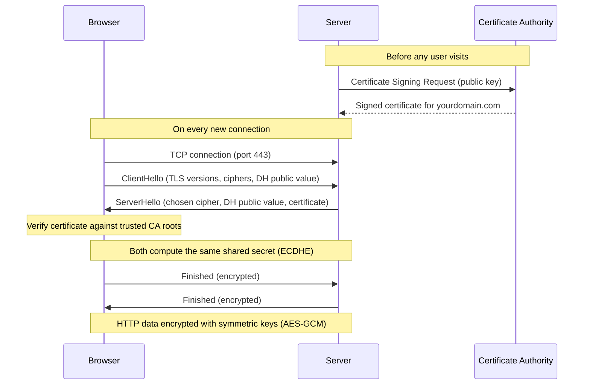

As frontend engineers, we spend most of our time in components, state and bundles. But every byte of that work travels over HTTP or HTTPS, and the difference between the two affects security, performance, SEO and even which browser APIs your app is allowed to use.

## HTTP vs HTTPS: the core difference

**HTTP (HyperText Transfer Protocol)** sends data as plain text. Anyone sitting between the browser and the server (WiFi router, ISP, proxy) can read or modify the request and response.

**HTTPS** is the same HTTP protocol tunnelled through **TLS (Transport Layer Security)**. TLS adds three guarantees:

1. **Encryption** — nobody in the middle can read the data.
2. **Integrity** — nobody can modify the data without detection.
3. **Authentication** — the browser can verify it is really talking to `yourdomain.com` and not an impostor.

## Why HTTPS matters specifically for frontend apps

HTTPS is not just a backend concern. Browsers actively change how your frontend behaves based on the protocol:

* **Powerful APIs need a secure context.** Service Workers (so PWAs and offline support), `navigator.geolocation`, camera/microphone via `getUserMedia`, clipboard API, Web Push and `crypto.subtle` only work on HTTPS.
* **HTTP/2 and HTTP/3** are only offered by browsers over HTTPS. That means multiplexed requests and faster page loads are effectively HTTPS-only.
* **Mixed content blocking.** An HTTPS page that loads scripts or XHR over plain HTTP gets those requests blocked by the browser.
* **Secure cookies.** Cookies with the `Secure` attribute (and `SameSite=None`, needed for cross-site requests) are only sent over HTTPS.
* **SEO and trust.** Google uses HTTPS as a ranking signal, and browsers mark HTTP pages as "Not secure".
* **Referrer and data leaks.** On HTTP, URLs, tokens in query params and form data are visible to any network middleman.

## The algorithm behind HTTPS

HTTPS is built on a clever combination of **asymmetric** and **symmetric** cryptography. Here is the flow for a modern TLS 1.3 connection:

### Step 0: The certificate (before any user visits)

The site owner generates a **public/private key pair** and asks a **Certificate Authority (CA)** like Let's Encrypt to issue a certificate. The CA verifies domain ownership and signs a certificate that says "this public key belongs to `yourdomain.com`". Browsers ship with a list of trusted CA root certificates.

### Step 1: TCP connection

The browser opens a TCP connection to the server (usually port 443).

### Step 2: TLS handshake

1. **ClientHello** — the browser sends the TLS versions and cipher suites it supports, plus its half of a key exchange: it picks a random private value and sends the corresponding public value (**Elliptic Curve Diffie-Hellman**, ECDHE).
2. **ServerHello** — the server picks the cipher suite, sends its own Diffie-Hellman public value and its **certificate**.
3. **Key computation** — browser and server independently combine "their own private value + the other side's public value" to arrive at the **same shared secret**. The magic of Diffie-Hellman is that an eavesdropper who saw both public values still cannot compute this secret.
4. **Certificate verification** — the browser checks that the certificate is signed by a trusted CA, matches the domain, and is not expired or revoked. The server proves it holds the private key by signing the handshake messages.

Here is the whole flow visualised:

### Step 3: Symmetric encryption for actual data

Asymmetric crypto is slow, so it is only used for the handshake. The shared secret is used to derive **symmetric session keys** (typically AES-GCM or ChaCha20-Poly1305), and all HTTP data is then encrypted with those. Every record also carries an authentication tag, which gives integrity — any tampering makes decryption fail.

So the algorithm in one line:

> **Asymmetric crypto (ECDHE + certificates) to authenticate the server and agree on a secret, then fast symmetric crypto (AES) to encrypt the actual HTTP traffic.**

A nice property of ECDHE is **forward secrecy**: session keys are ephemeral, so even if the server's private key leaks in the future, previously recorded traffic cannot be decrypted.

## Interview questions on HTTP & HTTPS (Senior Frontend Engineer)

**1. Why do Service Workers require HTTPS?**

A Service Worker can intercept and rewrite every network request of your origin. If it could be installed over plain HTTP, a network attacker could inject a malicious worker once and keep controlling the site even after the user leaves the compromised network. HTTPS guarantees the worker script really came from your origin. (`localhost` is exempted for development.)

**2. What is mixed content and how do you fix it?**

Mixed content is an HTTPS page loading sub-resources over HTTP. Browsers block "active" mixed content (scripts, stylesheets, XHR/fetch, iframes) and upgrade or warn about "passive" content (images, media). Fixes: use protocol-relative or absolute HTTPS URLs, add `Content-Security-Policy: upgrade-insecure-requests`, and audit third-party embeds.

**3. Explain what happens in the TLS handshake at a high level.**

Client and server exchange hello messages with supported cipher suites, perform an ephemeral Diffie-Hellman key exchange to agree on a shared secret, the server authenticates itself with a CA-signed certificate, and both sides derive symmetric session keys used to encrypt the HTTP traffic.

**4. Why does HTTPS use both asymmetric and symmetric encryption?**

Asymmetric encryption solves key distribution and authentication (you can verify the server without any pre-shared secret) but is computationally expensive. Symmetric encryption is orders of magnitude faster. TLS uses asymmetric crypto once per handshake to establish a shared key, then symmetric crypto for the data.

**5. What are `Secure`, `HttpOnly` and `SameSite` cookie attributes?**

`Secure` — cookie is only sent over HTTPS. `HttpOnly` — cookie is invisible to `document.cookie`, mitigating XSS token theft. `SameSite` (`Lax`/`Strict`/`None`) — controls whether the cookie is sent on cross-site requests, the main defence against CSRF. `SameSite=None` requires `Secure`.

**6. What is HSTS?**

`Strict-Transport-Security` is a response header telling the browser to always use HTTPS for this domain for a given `max-age`, even if the user types `http://`. It prevents SSL-stripping attacks where an attacker downgrades the first plain-HTTP request. With `preload`, the domain can be baked into browsers' HSTS lists so even the very first request is protected.

**7. Is HTTPS traffic completely hidden from an observer?**

No. The observer still sees the domain you connect to (via DNS and the SNI field of the handshake), IP addresses, timing and sizes of traffic. The URL path, headers and bodies are encrypted. Encrypted Client Hello (ECH) and DNS-over-HTTPS aim to close the remaining gaps.

**8. How does HTTPS relate to HTTP/2 and HTTP/3 performance?**

Browsers only negotiate HTTP/2 and HTTP/3 over encrypted connections (via ALPN during the TLS handshake). HTTP/2 brings multiplexing (many requests over one connection, no head-of-line blocking at the HTTP level) and header compression. HTTP/3 runs on QUIC over UDP, combining the transport and TLS handshake to cut connection setup latency. So in practice, moving to HTTPS is a prerequisite for the biggest network performance wins in frontend.

**9. Does HTTPS protect against XSS or CSRF?**

No. HTTPS only protects data **in transit**. XSS is a code-injection problem in your application, and CSRF abuses the browser's cookie behaviour — both happen over perfectly encrypted connections. You still need output escaping, CSP, `SameSite` cookies and CSRF tokens.

**10. A user reports "your site says Not Secure". What could be the reasons?**

The page is served over HTTP, the certificate is expired / self-signed / issued for a different hostname, an incomplete certificate chain is served, or the page contains mixed content. Debug via the browser's security panel in DevTools.

## Summary

HTTP sends readable plain text; HTTPS wraps the same protocol in TLS to give encryption, integrity and authentication. The algorithm behind it: an ephemeral Diffie-Hellman key exchange authenticated by CA-signed certificates, followed by fast symmetric encryption of the actual traffic. For frontend engineers HTTPS is not optional — it unlocks Service Workers, HTTP/2/3, secure cookies and user trust.
