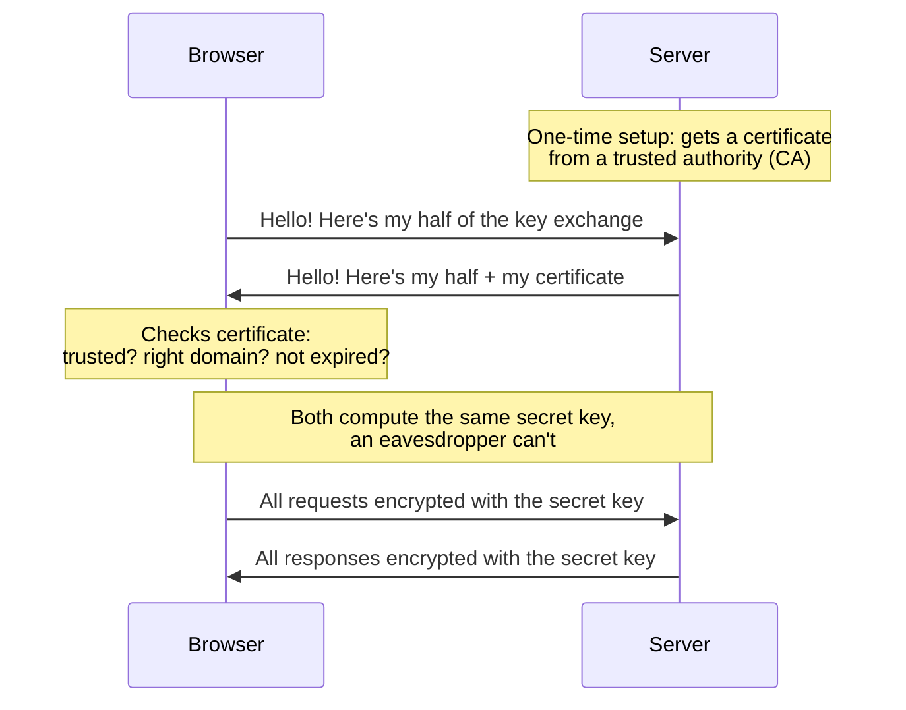

Every request your frontend makes — every page, API call, image and script — travels over HTTP or HTTPS. The difference between the two decides whether that data can be read by strangers, how fast your site loads, and even which browser features your app is allowed to use.

Let's break it down in simple words.

## HTTP vs HTTPS: the postcard vs the sealed envelope

Think of **HTTP** as sending a **postcard**. Anyone who handles it on the way — the WiFi router at the cafe, your ISP, a proxy server — can read it and even change what's written on it.

**HTTPS** is the same message in a **sealed, tamper-proof envelope** with the sender's identity verified. It's simply HTTP + a security layer called **TLS**, which gives you three things:

1. **Encryption** — no one in the middle can read the data.
2. **Integrity** — if anyone changes the data, the browser detects it and rejects it.
3. **Authentication** — you're sure you're talking to the real `swiggy.com`, not a fake one.

## Real-life situations where this actually matters

**1. Logging in on cafe/airport WiFi.**
On HTTP, your password travels as plain text. The person running the WiFi (or anyone else on it) can capture it. On HTTPS, they only see scrambled bytes.

**2. Payment pages.**
Card numbers, UPI IDs, addresses — all of it goes into request bodies. HTTP exposes them; HTTPS seals them. This is why no payment gateway works over HTTP.

**3. ISPs injecting ads into your website.**
This really happens — some ISPs inject ad banners or tracking scripts into pages served over HTTP. Your users see a modified version of your site and blame you. HTTPS makes this tampering impossible.

**4. Your PWA or "use my location" feature silently failing.**
Service Workers (offline support, push notifications), geolocation, camera/mic and clipboard access only work on HTTPS. If your food delivery app can't detect the user's location on HTTP, that's not a bug — the browser blocked it.

**5. Slower page loads.**
HTTP/2 and HTTP/3 (which load many resources in parallel over one connection) are only enabled by browsers over HTTPS. Staying on HTTP literally makes your site slower.

**6. Google ranking and the "Not secure" label.**
Google ranks HTTPS sites higher, and Chrome shows a "Not secure" warning next to HTTP URLs. Users bounce when they see that.

## How HTTPS works — the simple version

Here's the puzzle HTTPS solves: **the browser and server want to agree on a secret key, while someone may be listening to every message between them.**

The trick is a clever piece of math called a **key exchange (Diffie-Hellman)**. A simple analogy — mixing paint:

1. Browser and server publicly agree on a **common color**. (Everyone can see this.)
2. Each side secretly picks a **private color** and never shares it.
3. Each side mixes the common color with its private color and **sends the mixture** to the other. (Eavesdropper sees both mixtures.)
4. Each side mixes the *received* mixture with its **own private color**. Both end up with the **exact same final color** — the shared secret.

The eavesdropper has the common color and both mixtures, but "un-mixing" paint is practically impossible. Same with the math version — an observer who saw everything still can't compute the secret.

One problem remains: how does the browser know it's mixing paint with the *real* server and not an impostor? That's where **certificates** come in. The site owner gets a certificate from a trusted **Certificate Authority (CA)** like Let's Encrypt, which verifies domain ownership and vouches: "this key really belongs to this domain". Browsers ship with a list of trusted CAs, so they can check this instantly.

The whole flow:

And the final detail: the key-exchange math is slow, so it's done **once** at the start of the connection. After that, both sides switch to fast **symmetric encryption** (AES) using the shared secret for all the actual data.

> **HTTPS in one line: slow-but-clever math to verify the server and agree on a secret, then fast encryption (AES) for everything after.**

## Frontend interview questions on HTTP & HTTPS

**1. Why do Service Workers require HTTPS?**

A Service Worker can intercept every network request of your site. If it could be installed over HTTP, an attacker on the network could inject a malicious one that keeps controlling the site even after the user goes home. HTTPS guarantees the worker script genuinely came from your domain. (`localhost` is exempted so you can develop locally.)

**2. What is mixed content?**

An HTTPS page loading some resources (scripts, API calls, images) over plain HTTP. It breaks the "everything is sealed" promise, so browsers block the dangerous ones (scripts, fetch/XHR, iframes) and warn about images. Fix: make every URL HTTPS, or add the header `Content-Security-Policy: upgrade-insecure-requests`.

**3. Explain the HTTPS/TLS handshake simply.**

Browser and server exchange hellos, do a key exchange (each shares a public half, keeps a private half, both derive the same secret), the server proves its identity with a CA-signed certificate, and then all traffic is encrypted with fast symmetric keys derived from that secret.

**4. Why does HTTPS use two kinds of encryption?**

Asymmetric (public/private key) crypto solves "how do two strangers agree on a secret in public" — but it's slow. Symmetric crypto (AES) is very fast but needs a shared secret first. So TLS uses asymmetric once for the handshake, then symmetric for all the data.

**5. What do the `Secure`, `HttpOnly` and `SameSite` cookie attributes do?**

`Secure` — cookie is only sent over HTTPS. `HttpOnly` — JavaScript can't read it (`document.cookie`), protecting session tokens from XSS. `SameSite` — controls whether the cookie is sent on requests from other sites, the main defence against CSRF. Note: `SameSite=None` (needed for cross-site cookies) only works together with `Secure`.

**6. What is HSTS?**

A response header (`Strict-Transport-Security`) that tells the browser: "always use HTTPS for this domain, even if the user types `http://`". It closes the small gap where the very first request could go over HTTP and be hijacked.

**7. If the site uses HTTPS, is everything hidden from my ISP?**

Not everything. The ISP still sees *which domain* you visit and how much data flows. What's hidden: the exact URLs, headers, cookies and request/response bodies.

**8. Does HTTPS make my site faster or slower?**

Effectively faster. The handshake adds a tiny one-time cost, but HTTPS unlocks HTTP/2 and HTTP/3 — parallel downloads over a single connection — which outweighs it easily on real pages.

**9. Does HTTPS protect against XSS or CSRF?**

No. HTTPS only protects data **while it travels**. XSS (injected scripts) and CSRF (forged requests riding on cookies) happen inside the browser and your app, over perfectly encrypted connections. You still need escaping, CSP, `SameSite` cookies and CSRF tokens.

**10. A user says your site shows "Not secure". What do you check?**

Is the page served over HTTP? Is the certificate expired, self-signed, or issued for a different domain? Is there mixed content on the page? The Security tab in Chrome DevTools tells you exactly which one it is.

## Summary

HTTP is a postcard — readable and editable by anyone on the way. HTTPS is a sealed envelope from a verified sender: a one-time key exchange (backed by certificates) sets up a shared secret, and fast symmetric encryption protects everything after. For frontend developers it's not optional — logins, payments, PWAs, geolocation, HTTP/2 speed and Google ranking all depend on it.
